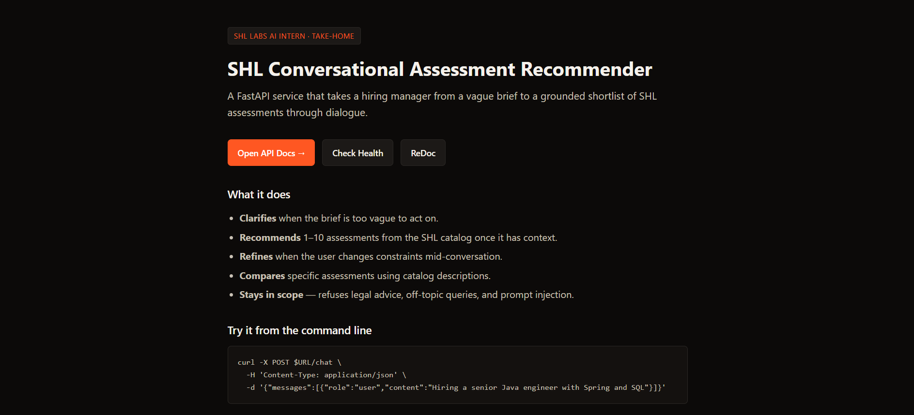
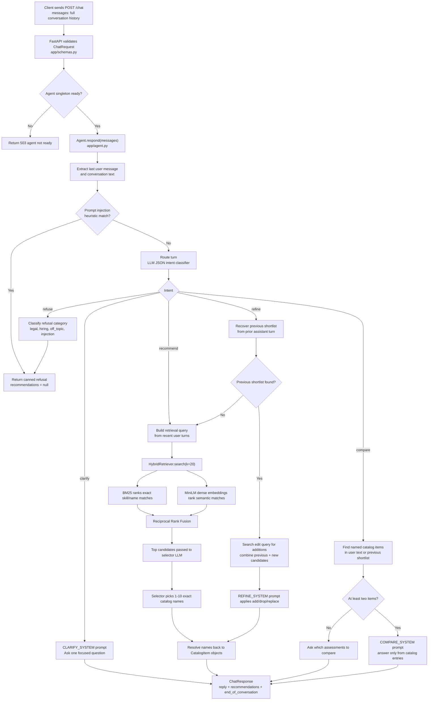
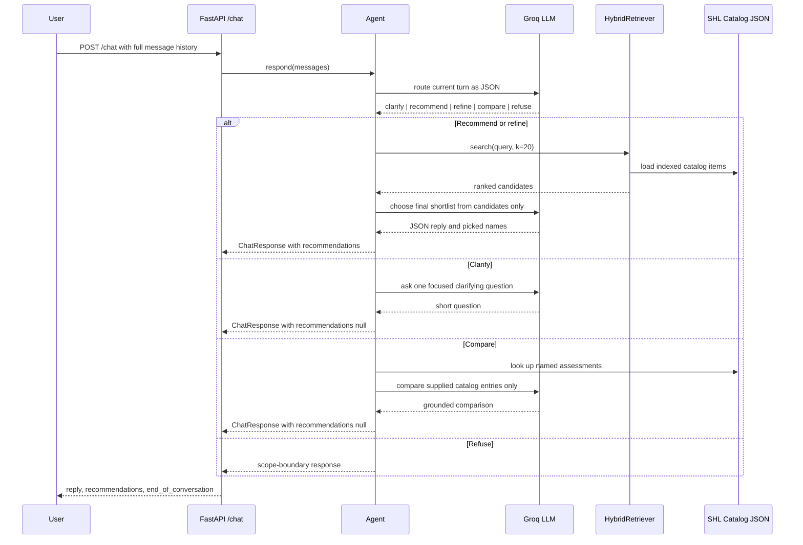

# SHL Conversational Assessment Recommender

Recruiter-friendly FastAPI service that turns a hiring brief into a grounded shortlist of SHL assessments. The assistant can clarify vague requirements, recommend catalog-backed assessments, refine a previous shortlist, compare named products, and refuse off-topic or unsafe requests.

Built for the SHL Labs AI Intern take-home by **Nihal Jaiswal**.

## Demo

**Live Space / Demo Link:** [Add your deployed Space or app URL here](https://huggingface.co/spaces/your-username/shl-recommender)

**Home Page Preview:** [Open screenshot](./Home_Page.png)



## Why this project matters

Hiring managers often describe a role in loose language: "senior Java developer", "graduate trainee scheme", or "leadership assessment". This project converts that intent into a structured, catalog-grounded assessment recommendation flow.

The system is designed to be practical for an evaluation setting:

- **Grounded output:** every recommendation URL comes from the local SHL catalog.
- **Conversational handling:** supports clarification, recommendation, refinement, comparison, and refusal.
- **Hybrid retrieval:** combines exact keyword search with semantic retrieval.
- **Testable offline:** `GROQ_API_KEY=stub` runs deterministic tests without network LLM calls.
- **Deployable:** includes a Render-ready `render.yaml`.

## Core Features

- **Clarifies vague briefs** before recommending products too early.
- **Recommends 1-10 SHL assessments** with canonical names, URLs, and test type codes.
- **Refines existing shortlists** when users ask to drop, add, replace, or change focus.
- **Compares named assessments** using catalog descriptions instead of model memory.
- **Defends scope** against legal advice requests, general hiring-process advice, and prompt injection.
- **Keeps state client-side** by requiring the caller to send full conversation history on every `/chat` call.

## Tech Stack

| Area | Technology |
|---|---|
| API | FastAPI, Uvicorn |
| Schemas | Pydantic |
| LLM | Groq client, default `llama-3.3-70b-versatile` |
| Retrieval | BM25 via `rank-bm25`, dense embeddings via `sentence-transformers/all-MiniLM-L6-v2` |
| Ranking | Reciprocal Rank Fusion |
| Data | Local SHL product catalog JSON |
| Testing | Pytest, deterministic LLM stub |
| Deployment | Render web service config |

## Project Structure

```mermaid
flowchart TD
    ROOT["shl-recommender/"]

    ROOT --> APP["app/"]
    ROOT --> DATA["data/"]
    ROOT --> TESTS["tests/"]
    ROOT --> README["README.md"]
    ROOT --> APPROACH["APPROACH.md"]
    ROOT --> RENDER["render.yaml"]
    ROOT --> REQS["requirements.txt"]
    ROOT --> HOME["Home_Page.png"]

    APP --> MAIN["main.py<br/>FastAPI app, startup lifecycle, /, /health, /chat"]
    APP --> AGENT["agent.py<br/>Router plus clarify/recommend/refine/compare/refuse handlers"]
    APP --> RETRIEVER["retriever.py<br/>Hybrid BM25 + dense retrieval with RRF"]
    APP --> INDEXER["indexer.py<br/>Builds and warms catalog index"]
    APP --> CATALOG["catalog.py<br/>Catalog loader and test type code mapping"]
    APP --> LLM["llm.py<br/>Groq wrapper, JSON mode, retries, offline stub"]
    APP --> PROMPTS["prompts.py<br/>Router, selector, refine, compare, refusal prompts"]
    APP --> SCHEMAS["schemas.py<br/>Pydantic request and response models"]

    DATA --> CATALOG_JSON["shl_product_catalog.json<br/>Local SHL assessment catalog"]
    DATA --> TRACES["traces/<br/>C1-C10 public conversation traces"]

    TESTS --> UNIT["test_agent.py<br/>Schema, catalog, retrieval, and agent behavior tests"]
    TESTS --> REPLAY["replay.py<br/>Replay trace conversations and report Recall@10"]
```



## Code Flow



## Request Lifecycle



## API Contract

### Health

```http
GET /health
```

Response:

```json
{"status": "ok"}
```

### Chat

```http
POST /chat
Content-Type: application/json
```

Request:

```json
{
  "messages": [
    {
      "role": "user",
      "content": "Hiring a senior backend engineer. Core Java, Spring, SQL, AWS, Docker."
    }
  ]
}
```

Response:

```json
{
  "reply": "Here is a focused shortlist from the SHL catalog.",
  "recommendations": [
    {
      "name": "Core Java (Advanced Level)",
      "url": "https://www.shl.com/products/product-catalog/...",
      "test_type": "K"
    }
  ],
  "end_of_conversation": false
}
```

## Quickstart

```bash
python -m venv .venv

# Windows PowerShell
.\.venv\Scripts\Activate.ps1

# Linux/macOS
source .venv/bin/activate

python -m pip install --upgrade pip
pip install -r requirements.txt

# Warm the retriever and embedding model
python -m app.indexer

# Run the API
uvicorn app.main:app --reload --port 8000
```

Open:

- App home page: `http://localhost:8000/`
- Swagger docs: `http://localhost:8000/docs`
- Health check: `http://localhost:8000/health`

## Environment Variables

| Variable | Required | Purpose |
|---|---:|---|
| `GROQ_API_KEY` | Yes for live LLM, use `stub` for tests | Enables Groq chat completions |
| `GROQ_MODEL` | No | Defaults to `llama-3.3-70b-versatile` |
| `LOG_LEVEL` | No | Defaults to `INFO` |

PowerShell example:

```powershell
$env:GROQ_API_KEY="gsk_..."
uvicorn app.main:app --reload --port 8000
```

## Test
```bash
curl localhost:8000/health
# {"status":"ok"}

curl -X POST localhost:8000/chat \
  -H 'Content-Type: application/json' \
  -d '{"messages":[{"role":"user","content":"Hiring a senior Java engineer with Spring and SQL"}]}'

```  
## Run the tests

Run deterministic offline unit tests:

```powershell
$env:GROQ_API_KEY="stub"
python -m pytest tests/test_agent.py -q
```

Replay the public conversation traces:

```powershell
$env:GROQ_API_KEY="stub"
python -m tests.replay
```

The replay script reads `data/traces/C1.md` through `C10.md`, simulates the user turns, and reports Recall@10 against the final ground-truth shortlist in each trace.

## Deployment

This repository includes `render.yaml` for Render deployment.

1. Push the project to GitHub.
2. Create a new Render Web Service.
3. Use the included `render.yaml` or configure manually:
   - Build command: `pip install -r requirements.txt && python -m app.indexer`
   - Start command: `uvicorn app.main:app --host 0.0.0.0 --port $PORT --workers 1`
   - Health check path: `/health`
4. Add `GROQ_API_KEY` in the Render dashboard.

## Design Decisions

### Router-first agent

The system uses a small JSON-mode router before deciding what to do. That keeps vague briefs from triggering premature retrieval, keeps compare questions from creating new shortlists, and gives each behavior a focused prompt.

### Hybrid retrieval

BM25 is strong for exact product and skill names such as `Docker`, `OPQ32r`, or `Microsoft Excel`. Dense retrieval helps with intent-style phrasing such as "call center agents" or "senior leadership". Reciprocal Rank Fusion combines both rankings without hand-tuned weights.

### Catalog-grounded selector

The selector LLM receives only the retrieved candidate list. Final picks are resolved back to catalog objects before returning the response, so names, URLs, and test type codes are always sourced from the local catalog.

### Offline-safe tests

When `GROQ_API_KEY=stub`, the Groq wrapper returns deterministic responses. This makes schema, retrieval, and agent flow tests repeatable without external calls.

## Evaluation Readiness

- `/health` returns the required status payload.
- `/chat` follows the required response schema.
- Recommendations are capped at 10.
- URLs are catalog-backed.
- The service is stateless and accepts full conversation history.
- Public traces can be replayed locally through `tests/replay.py`.

