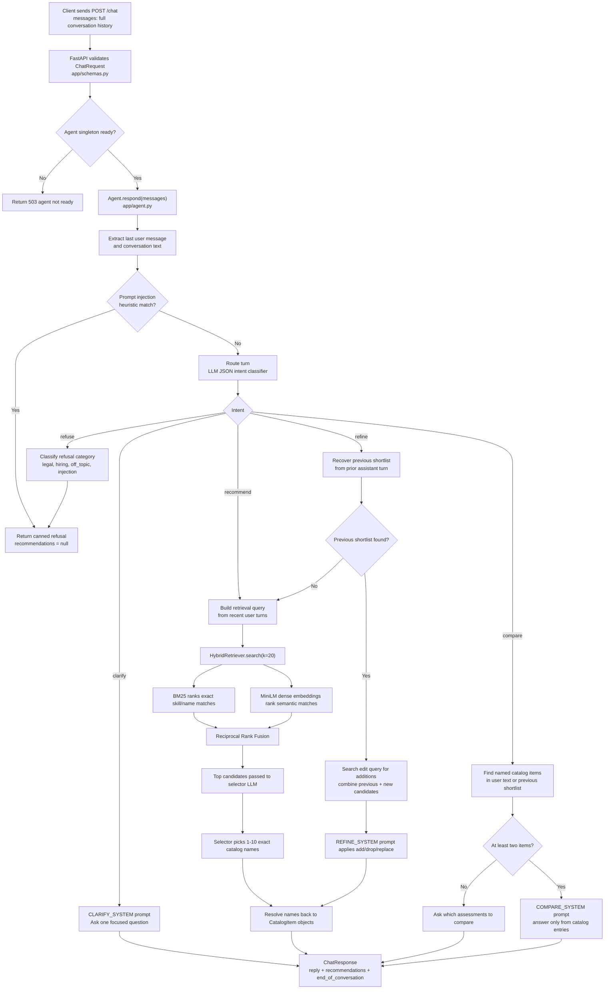
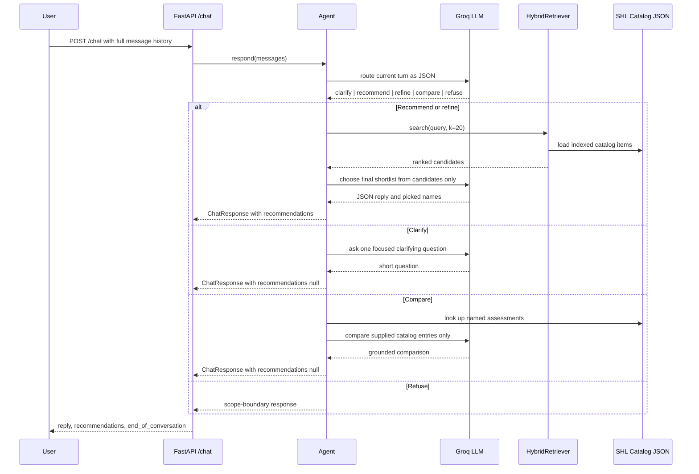

# SHL Conversational Assessment Recommender

A recruiter-friendly FastAPI service that takes a hiring manager from a vague intent such as "I'm hiring a Java developer" to a grounded shortlist of SHL assessments through dialogue. Built for the SHL Labs AI Intern take-home.

Built by [Nihal Jaiswal](https://github.com/Nihal108-bi).

## Demo

**Live Hugging Face Space:** https://nihal108-bi-shl-conversational-recommender.hf.space/

**API Docs:** https://nihal108-bi-shl-conversational-recommender.hf.space/docs


## What It Does

- **Clarifies** when the brief is too vague to act on, for example "we need an assessment for senior leadership".
- **Recommends** 1-10 items from the SHL catalog once it has enough context, with names, test type codes, and canonical URLs.
- **Refines** when the user changes constraints mid-conversation, such as dropping AWS, adding SQL, or switching from screening to development.
- **Compares** named assessments using catalog descriptions rather than the LLM's prior knowledge.
- **Stays in scope** by refusing legal advice, general hiring strategy, off-topic prompts, and prompt-injection attempts.
- **Returns grounded URLs** because every recommendation is resolved from the local catalog index.

## Why This Project Matters

Hiring teams often describe roles in natural language instead of structured assessment criteria. This service bridges that gap: it asks for missing context when needed, retrieves relevant SHL catalog items, and uses an LLM only to select and explain from retrieved candidates.

The result is a practical assessment recommender that is conversational for recruiters, constrained for evaluation, and transparent enough for technical review.

## Tech Stack

| Area | Technology |
|---|---|
| API | FastAPI, Uvicorn |
| Schemas | Pydantic v2 |
| LLM | Groq, default `llama-3.3-70b-versatile` |
| Retrieval | BM25 via `rank-bm25`, dense embeddings via `sentence-transformers/all-MiniLM-L6-v2` |
| Ranking | Reciprocal Rank Fusion |
| Data | Local SHL product catalog JSON |
| Testing | Pytest, deterministic LLM stub |
| Deployment | Hugging Face Spaces with Docker, `app_port: 7860` |

## API

| Endpoint | Purpose |
|---|---|
| `GET /` | Landing page |
| `GET /health` | Health check, returns `{"status": "ok"}` |
| `GET /docs` | Swagger UI with copy-paste-ready examples |
| `GET /redoc` | ReDoc API documentation |
| `POST /chat` | Stateless chat endpoint |

Try the deployed Space:

```bash
curl https://<your-space>.hf.space/health

curl -X POST https://<your-space>.hf.space/chat \
  -H 'Content-Type: application/json' \
  -d '{"messages":[{"role":"user","content":"Hiring a senior Java engineer with Spring and SQL"}]}'
```

## Project Structure

```mermaid
flowchart TD
    ROOT["shl-recommender/"]

    ROOT --> APP["app/"]
    ROOT --> DATA["data/"]
    ROOT --> TESTS["tests/"]
    ROOT --> README["README.md<br/>HF Spaces metadata + project guide"]
    ROOT --> DOCKER["Dockerfile<br/>HF Spaces Docker deployment"]
    ROOT --> DOCKERIGNORE[".dockerignore<br/>Keeps image small and secrets out"]
    ROOT --> APPROACH["APPROACH.md<br/>Submission approach document"]
    ROOT --> REQS["requirements.txt<br/>Python dependencies + CPU torch"]
    ROOT --> HOME["Home_Page.png<br/>Home page screenshot"]

    APP --> MAIN["main.py<br/>FastAPI app, lifespan startup, /, /health, /chat"]
    APP --> AGENT["agent.py<br/>Router plus clarify/recommend/refine/compare/refuse handlers"]
    APP --> RETRIEVER["retriever.py<br/>Hybrid BM25 + dense retrieval with RRF"]
    APP --> INDEXER["indexer.py<br/>Warms catalog index and embedding model"]
    APP --> CATALOG["catalog.py<br/>Catalog loader and K/P/A/B/S/C/D code mapping"]
    APP --> LLM["llm.py<br/>Groq wrapper, retries, JSON mode, offline stub"]
    APP --> PROMPTS["prompts.py<br/>Router, selector, refine, compare, refusal prompts"]
    APP --> SCHEMAS["schemas.py<br/>Pydantic API contract"]

    DATA --> CATALOG_JSON["shl_product_catalog.json<br/>Local SHL assessment catalog"]
    DATA --> TRACES["traces/<br/>C1-C10 public conversation traces"]

    TESTS --> UNIT["test_agent.py<br/>Schema, catalog, retrieval, and agent flow tests"]
    TESTS --> REPLAY["replay.py<br/>Trace replay and Recall@10 report"]
```



## Code Flow



## Request Lifecycle



## Hugging Face Spaces Deployment

This project is configured for **Hugging Face Spaces Docker deployment**. The README front matter tells Spaces to use Docker and expose the FastAPI service on port `7860`.

```yaml
sdk: docker
app_port: 7860
```

Deployment checklist:

1. Create a new Hugging Face Space.
2. Choose **Docker** as the Space SDK.
3. Push this repository to the Space.
4. Add `GROQ_API_KEY` in **Settings -> Repository secrets**.
5. Wait for the Docker build to finish.
6. Open `https://<your-space>.hf.space/docs` and test `/chat`.

The `Dockerfile` installs dependencies, pre-warms the SHL retriever with `python -m app.indexer`, exposes port `7860`, and starts:

```bash
uvicorn app.main:app --host 0.0.0.0 --port 7860 --workers 1
```

## Local Development

```bash
python -m venv .venv

# Windows PowerShell
.\.venv\Scripts\Activate.ps1

# Linux/macOS
source .venv/bin/activate

python -m pip install --upgrade pip
pip install -r requirements.txt

# Warm the retriever and embedding model
python -m app.indexer

# Run the API locally
uvicorn app.main:app --reload --port 8000
```

Open locally:

- Home page: `http://localhost:8000/`
- Swagger docs: `http://localhost:8000/docs`
- Health check: `http://localhost:8000/health`

## Environment Variables

| Variable | Required | Purpose |
|---|---:|---|
| `GROQ_API_KEY` | Yes for live LLM, use `stub` for tests | Enables Groq chat completions |
| `GROQ_MODEL` | No | Defaults to `llama-3.3-70b-versatile` |
| `LOG_LEVEL` | No | Defaults to `INFO` |

PowerShell example:

```powershell
$env:GROQ_API_KEY="gsk_..."
uvicorn app.main:app --reload --port 8000
```

## Test the API Locally

```bash
curl localhost:8000/health

curl -X POST localhost:8000/chat \
  -H 'Content-Type: application/json' \
  -d '{"messages":[{"role":"user","content":"Hiring a senior Java engineer with Spring and SQL"}]}'
```

## Run Tests

Run deterministic offline unit tests:

```powershell
$env:GROQ_API_KEY="stub"
python -m pytest tests/test_agent.py -q
```

Replay the public conversation traces:

```powershell
$env:GROQ_API_KEY="stub"
python -m tests.replay
```

The replay script reads `data/traces/C1.md` through `C10.md`, simulates the user turns, and reports Recall@10 against the final ground-truth shortlist in each trace.

## Design Decisions

### Router-first agent

The system uses a small JSON-mode router before deciding what to do. That keeps vague briefs from triggering premature retrieval, keeps compare questions from creating new shortlists, and gives each behavior a focused prompt.

### Hybrid retrieval

BM25 is strong for exact product and skill names such as `Docker`, `OPQ32r`, or `Microsoft Excel`. Dense retrieval helps with intent-style phrasing such as "call center agents" or "senior leadership". Reciprocal Rank Fusion combines both rankings without hand-tuned weights.

### Catalog-grounded selector

The selector LLM receives only the retrieved candidate list. Final picks are resolved back to catalog objects before returning the response, so names, URLs, and test type codes are always sourced from the local catalog.

### Offline-safe tests

When `GROQ_API_KEY=stub`, the Groq wrapper returns deterministic responses. This makes schema, retrieval, and agent flow tests repeatable without external calls.

## Evaluation Readiness

- `/health` returns the required status payload.
- `/chat` follows the required response schema.
- Recommendations are capped at 10.
- URLs are catalog-backed.
- The service is stateless and accepts full conversation history.
- Public traces can be replayed locally through `tests/replay.py`.
- Hugging Face Spaces deployment is configured through README metadata and `Dockerfile`.

